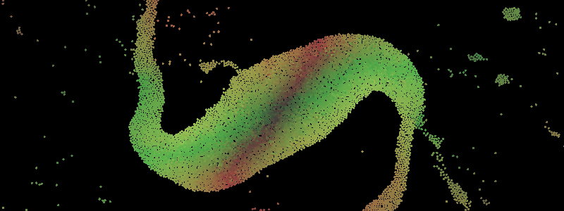

# Gpu Particle Simulation

A [Newtonian Gravity](https://en.wikipedia.org/wiki/Newton%27s_law_of_universal_gravitation) particle simulation on the GPU  

## Keybindings

Format: <kbd>Key</kbd> `Description` [default] (extra info)  

<kbd>Space</kbd> `Pause/Unpause simulation` [paused]  
<kbd>f</kbd> `Enable/Disable following center of mass` [disabled]  
<kbd>c</kbd> `Enable/Disable capture` [disabled] (Requires the `capture` feature)  

## Capture

When the `capture` feature is enabled (default) a `frame_buffer.bin` file is created.  
when capturing the `frame_buffer.bin` file will get filled with raw frames.  
`stdout` will contain the used parameters (Width, Height and Format)  

**NOTE:  
The frames are not seperated by any header or byte sequence.  
use `frame_buffer_to_video.sh` and input the parameters given from `stdout` when asked**

### Low Framerate (FPS)?  

the frames will be captured at a locked framerate  
if `30` fps is selected you'll get a `30` fps output.
